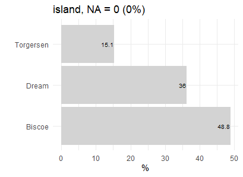

Simple R tricks to improve human perception of differences

## How many penguins are on each island?

Let's use {palmerpenguins} and analyse the number of penguins on each island.

```R
# packages
library(tidyverse)
library(explore)
library(palmerpenguins)
```

### Count it!

A simple way to answer this question ist to use ```count()```

```R
penguins %>% count(island)
```
```
# A tibble: 3 x 2
  island        n
  <fct>     <int>
1 Biscoe      168
2 Dream       124
3 Torgersen    52
```
Just looking to the number, we can easily find out that most of the penguins are living on the Biscoe island. On 2nd place is Dream island, and Torgersen island on 3rd. But it is hard to get an accurate feeling of the differences between the number of penguins on these islands. 

### Add percentage!

Adding percentage helps a lot. We can do that by using ```count_pct``` from {explore}

```R
penguins %>% count_pct(island)
```
```
# A tibble: 3 x 4
  island        n total   pct
  <fct>     <int> <int> <dbl>
1 Biscoe      168   344  48.8
2 Dream       124   344  36.0
3 Torgersen    52   344  15.1
```

Now we can see that 168 of 344 penguins are living on Biscoe island. The percentage is 48.8, so that is almost the half of the penguins.
We got a much clearer view on the data. 

The count_pct function is quite simple:

```R
count_pct <- function(data, ...)  {
  d <- data %>%
    dplyr::count(...)
  d <- d %>%
    dplyr::mutate(total = sum(n),
                  pct = n / sum(n) * 100.00)
  d
} 
```

But we can still improve it!


### Visualise it!

Cognitive studies proved that people can understand visualisations much better and faster than just values (Ref: https://www.bbc.com/news/business-17682294).

We can use barcharts to visualise the number of penguins on each island, as it is very easy for humans to compare the length of objects (like the length of bars).
{explore} offers a simple way to create bar plots:

```R
penguins %>% 
  explore(island)
```


By just looking to the bars, we instantly get a good understanding of the differences between the islands!

If you want to use ggplot2 to build an individual plot:

```R
penguins %>% 
  count_pct(island) %>% 
    ggplot(aes(island, pct)) + 
    geom_col(fill = "grey") +
    geom_text(aes(y=pct, label=paste0(round(pct,1),"%")), 
              hjust=1, size=3) +
    coord_flip() +
    theme_light()
```

But 10 minutes later, you may have already forgotten which island ranked on wich place. 
Because these are just numbers without any meaning to your brain. 

### Add meaning!

If we can add some insights about the relationship between penguins and islands, our brain will just naturally remember much more.

We can do that by using the ```explain_tree()``` function from {explore}


