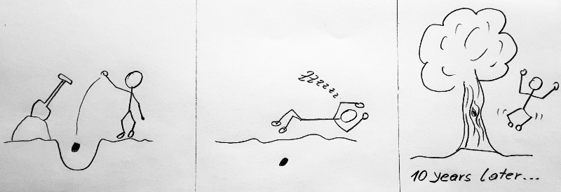

R-packages are a great way to structure and share code. Let's give it a try!



## Where to start from

Most of the times you already have some R-code that is oranised as a function. In this example we start with a very simple funkction `hello()` that is stored in a file called hello.R

```R
hello <- function(name = "my friend") {
   paste("Hello", name)
}
```

So, if you call `hello()` you get

```
[1] "Hello my friend"
```

So, if you call `hello("Tom")` you get

```
[1] "Hello Tom"
```


## Build a package
### Step 1: Create a new R-project

### Step 2: Update DESCRIPTION

### Step 3: Build package

### Step 4: Add Documentation

### Step 5: Add Unit Testing
